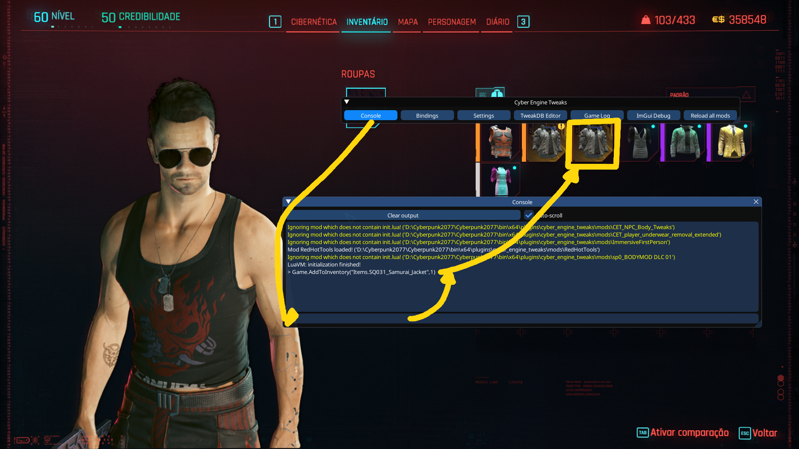

# Replace the Samurai logo by Typescript

The adjustment was made to the shirt t2_001_pma_jacket__short_sleeves_decal_badges_d01


## How to use?

1. install the mod [Material and Texture Override](https://www.nexusmods.com/cyberpunk2077/mods/5266), it is essential for changing textures.
2. Extract the file [V shirt with typescript logo.zip](V%20shirt%20with%20typescript%20logo.zip) into your game folder on your PC.

In my case, the Game folder is on disk D and is called Cyberpunk, an example of it:

```D:\Cyberpunk2077\REDprelauncher.exe```

Then extract the .zip so that it looks like this:

```D:\Cyberpunk2077\archive\pc\mod\V shirt with typescript logo.archive```

3. Now just start the game with the mods option activated.

> Remember, in my case, Cyberpunk is in the D:\Cyberpunk2077 folder, adjust it depending on your folder.


## How to get the shirt?

You can follow Johnny's missions or use [CET](https://www.nexusmods.com/cyberpunk2077/mods/107) just use the following command `Game.AddToInventory("Items.SQ031_Samurai_Jacket",1)`



## How to remove?

Remove ONLY the `V shirt with typescript logo.archive` file within `\archive\pc\mod\`


